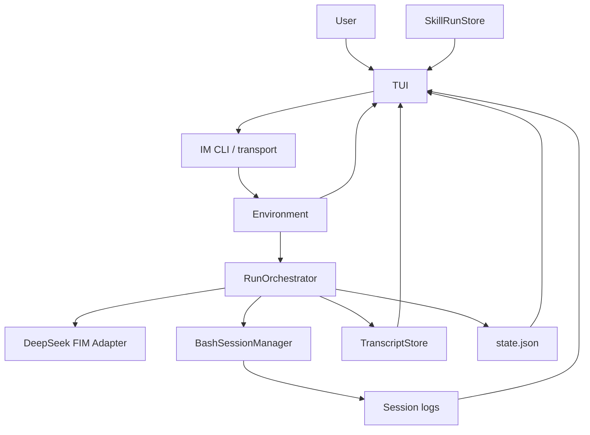

# TUI Design

本文记录 tiny-agent-harness 第一版 TUI 设计。

## Decision

TUI 是 observer / control surface，不是 harness 核心状态机。

它不拥有 Agent 状态，不参与模型决策，不直接改写 run state。它只读取已经存在的 durable artifacts，并把用户控制动作路由回现有边界。

```text
RunOrchestrator owns agent loop.
TranscriptStore owns run events.
BashSessionManager owns bash sessions.
Environment owns environment events and persistent reminder facts.
SkillRunStore owns skill run lifecycle.

TUI reads those facts and renders them.
```

推荐屏幕结构：

```text
┌────────────────────────────────────────────────────────────────────────────┐
│ Header: run id / status / step / cwd / model / active sessions / skills    │
├────────────────────────────────────────────────────────────────────────────┤
│ Conversation                                                               │
│ user messages, agent status replies, errors                                │
│                                                                            │
│                                                                            │
├────────────────────────────────────────────────────────────────────────────┤
│ Agent Loop Player                                                          │
│ step 000 model_requested                                                   │
│ step 000 thinking_received                                                 │
│ step 000 decision tool_call bash(session=default, command=...)             │
│ step 000 review approved                                                   │
│ step 000 bash finished rc=0 log=.tiny-agent/sessions/default.log           │
│ step 001 environment reminder ...                                          │
└────────────────────────────────────────────────────────────────────────────┘
```

上半屏是用户可理解的对话流。下半屏是 agent loop 播放器，用来展示 ReAct 执行过程。

## Design Principles

1. TUI 是 transcript player，不是第二个 run orchestrator。
2. TUI 的可恢复状态只能是 UI 状态，例如当前 focus、scroll offset、follow mode。
3. 所有业务事实都来自 transcript、state snapshot、session log、environment、skill run state。
4. 用户输入不能直接塞进模型上下文，必须通过 IM transport 或已有控制端口。
5. Bash 输出默认只显示 tail / excerpt，完整内容通过 log path 翻页。
6. TUI 退出不停止 run；run 停止也不要求 TUI 退出。
7. 第一版以清楚可调试为目标，不追求华丽动画。

## Non Goals

第一版不做：

- Web UI
- 多 run 并排监控
- 在 TUI 内编辑文件
- 在 TUI 内重新实现 bash session manager
- TUI 私有保存 agent 状态
- 让 TUI 绕过 tool review 执行命令
- 高级可视化图表

## CLI Shape

推荐入口：

```bash
tiny-agent run "fix tests" --tui
tiny-agent tui --run latest
tiny-agent tui --run run-2026-05-25T20-00-00Z
tiny-agent tui --run latest --replay
tiny-agent tui --run latest --follow
```

语义：

- `tiny-agent run --tui`: 启动 run，同时打开 live TUI。
- `tiny-agent tui --run latest`: attach 到最近 run。
- `--replay`: 从 transcript 起点播放，不自动跳到末尾。
- `--follow`: tail 新事件，默认 live 模式。

第一版可以只实现：

```bash
tiny-agent tui --run latest
```

## Data Sources

TUI 只读这些 durable artifacts：

```text
.tiny-agent/
  runs/
    <runId>/
      state.json
      transcript.jsonl
      prompts/
        step-000.md
  sessions/
    default.log
    server.log
    test.log
  im/
    default.inbox.jsonl
    default.outbox.jsonl
  skill-runs/
    <skillRunId>/
      state.json
      execution.txt
      review-task.txt
  skills/
    <skill>/
      attachments/
        lessons.md
```

Optional convenience pointer:

```text
.tiny-agent/runs/latest -> <runId>
```

如果不想做 symlink，也可以维护：

```text
.tiny-agent/runs/latest.json
```

内容：

```json
{
  "runId": "run-2026-05-25T20-00-00Z",
  "runDir": ".tiny-agent/runs/run-2026-05-25T20-00-00Z"
}
```

## Data Flow



TUI 读：

- transcript events
- latest run state
- session log tails
- IM inbox/outbox
- active skill run state

TUI 写：

- user message through IM transport
- optional control request through existing control boundary
- UI local preferences only

## View Model

TUI 不直接渲染原始 JSONL。它把 artifacts 归一化成 view model。

```ts
type TuiViewModel = {
  run: RunHeaderView;
  conversation: ConversationItem[];
  loop: LoopFrame[];
  sessions: SessionView[];
  activeSkills: ActiveSkillView[];
  selected?: Selection;
};
```

### RunHeaderView

```ts
type RunHeaderView = {
  runId: string;
  status: AgentRunStatus;
  stepIndex: number;
  maxSteps: number;
  cwd: string;
  model?: string;
  startedAt?: string;
  updatedAt?: string;
};
```

### ConversationItem

```ts
type ConversationItem =
  | {
      kind: "user";
      timestamp: string;
      channel: string;
      text: string;
      sourceEventId?: string;
    }
  | {
      kind: "agent";
      timestamp: string;
      text: string;
      messageKind: "status" | "error";
    }
  | {
      kind: "system";
      timestamp: string;
      text: string;
    };
```

Conversation pane 只显示人和 agent 的通信，不塞完整 tool trace。

### LoopFrame

```ts
type LoopFrame = {
  id: string;
  stepIndex: number;
  timestamp: string;
  phase:
    | "model"
    | "decision"
    | "validation"
    | "review"
    | "tool"
    | "observation"
    | "environment"
    | "io_wait"
    | "skill";
  status: "pending" | "running" | "ok" | "warn" | "error" | "waiting";
  title: string;
  summary: string;
  detail?: string;
  logPath?: string;
  transcriptEventId?: string;
};
```

Loop player 显示 `LoopFrame[]`，而不是直接显示所有 JSON。

### SessionView

```ts
type SessionView = {
  session: string;
  state: "idle" | "running" | "blocked" | "terminated";
  currentCommand?: string;
  returnCode?: number | null;
  logPath: string;
  tail: string;
  tailOffset?: number;
};
```

### ActiveSkillView

```ts
type ActiveSkillView = {
  skillRunId: string;
  skill: string;
  status: "running" | "review_pending";
  executionReturnCode?: number;
  executionLogPath: string;
  reviewTaskPath?: string;
};
```

## Event Mapping

Transcript event 到 UI 的映射：

```text
run_started
  -> Header status running
  -> LoopFrame phase=environment title="run started"

model_requested
  -> LoopFrame phase=model status=running title="model requested"

model_thinking_delta
  -> Update current model LoopFrame status=running title="model thinking"
  -> Append delta into LoopFrame detail section "thinking"

model_output_received(tool_call)
  -> LoopFrame phase=decision status=ok title="tool call: bash"
  -> Complete current model LoopFrame with final thinking/raw decision detail

model_output_received(io_wait)
  -> LoopFrame phase=io_wait status=waiting title="io wait requested"
  -> Complete current model LoopFrame with final thinking/raw decision detail

model_output_received(invalid_output)
  -> LoopFrame phase=decision status=warn title="invalid model output"
  -> Complete current model LoopFrame with final diagnostic detail

tool_call_validated(valid)
  -> LoopFrame phase=validation status=ok title="tool call validated"

tool_call_validated(invalid)
  -> LoopFrame phase=validation status=warn title="tool validation failed"

tool_review_requested
  -> LoopFrame phase=review status=running title="review requested"

tool_reviewed(approved)
  -> LoopFrame phase=review status=ok title="approved"

tool_reviewed(rejected)
  -> LoopFrame phase=review status=warn title="rejected"

tool_execution_started
  -> LoopFrame phase=tool status=running title="bash started"

tool_execution_finished
  -> LoopFrame phase=tool status=ok/error title="bash finished rc=<returnCode>"

observation_appended
  -> LoopFrame phase=observation status=warn/ok title="synthetic observation"

io_wait_started
  -> LoopFrame phase=io_wait status=waiting title="waiting for IO"

io_wait_satisfied
  -> LoopFrame phase=io_wait status=ok title="IO wait satisfied"

environment_events_consumed
  -> LoopFrame phase=environment status=ok title="environment reminder consumed"

agent_message_sent
  -> ConversationItem agent

user_message_received
  -> ConversationItem user

run_finished
  -> Header terminal status
  -> LoopFrame phase=environment status=ok/error title="run finished"
```

## Layout Details

### Header

Header 一行即可：

```text
run=run-123 status=waiting_for_io step=7/50 cwd=/repo model=deepseek-v4-pro sessions=2 skills=1
```

颜色建议：

- running / waiting: yellow
- completed: green
- failed / error: red
- cancelled: gray

### Conversation Pane

显示：

- user IM messages
- agent status messages, including user-facing completion replies sent through IM
- errors

不显示：

- 完整 bash 输出
- 完整 prompt
- 大段 raw JSON

输入栏放在 conversation pane 底部：

```text
message> _
```

发送后写入 IM transport，而不是直接调用模型。

### Agent Loop Player

默认占下半屏。

显示策略：

1. 每个 step 聚合成一个 block。
2. 当前 step 自动展开。
3. 历史 step 默认折叠，只显示 phase summary。
4. 失败、等待、review rejected、invalid output 自动高亮。
5. Bash output 只显示 observation excerpt 和 log path。
6. 选中某个 frame 后，右侧或弹窗显示 detail。

示例：

```text
step 004
  model       ok       thinking received (1820 chars)
  decision    ok       bash(session=default, command="npm test")
  validation  ok       valid
  review      ok       approved by always-approve
  tool        running  session=default timeout=30000 log=.tiny-agent/sessions/default.log

step 005
  environment ok       2 events consumed
  skill       waiting  coding-review review_pending task=.tiny-agent/skill-runs/skillrun-001/review-task.txt
```

## Reasoning Display

DeepSeek FIM pass 1 会生成 thinking artifact。

TUI 可以显示它，但建议默认折叠：

```text
thinking received (1820 chars) [press Enter to expand]
```

原因：

- 默认 UI 保持扫描友好。
- raw thinking 很长，会挤掉 tool trace。
- 面试展示时可以展开证明 two-pass ReAct 工作正常。

如果后续不想展示 raw thinking，可以改成只显示 thinking 摘要或保存路径。

## Log Viewing

TUI 不复制完整 log 到内存。

对 session log：

```text
read tail by byte offset
render newest N lines
keep selected logPath and offset in UI state
```

操作：

- 选中 `logPath` 后按 `o` 打开 log detail pane。
- detail pane 支持滚动。
- 按 `/` 在当前 log excerpt 内搜索。
- 完整搜索仍推荐通过 agent 自己用 bash 执行 `rg` / `sed` / `tail`。

## Follow And Selection

Conversation pane 和 Agent Loop pane 默认都保持置底。只有用户进入 browse mode 并用上下键移动当前 pane 时，该 pane 的 follow bottom 会暂停；另一个 pane 仍然可以继续置底。

回到 input mode 时：

- conversation follow bottom 恢复。
- loop follow bottom 恢复。
- loop selection 清除。

Conversation 是 transcript 与 IM poll 的合并 projection：

- 先按稳定 message key 去重。
- 再按 timestamp 升序渲染。
- timestamp 相同则保持进入 projection 的顺序。

Agent Loop 使用 frame-level selection。选中的是 `LoopFrame.id`，不是 blessed list 的文本行号。这样 step header、展开 detail 或 log path 增加额外行时，选中态仍然指向同一个 loop frame。

当 loop pane 处于 browse mode 且有选中 frame 时，下半屏切成左右两栏：

- 左侧：loop frame list。
- 右侧：selected frame detail，包括 step、phase、status、summary、detail、logPath。

## Keyboard

第一版快捷键：

```text
Esc          enter browse mode from input mode
Tab          switch focus between conversation and loop player in browse mode
j / Down     scroll down or move selected loop frame down
k / Up       scroll up or move selected loop frame up
g            jump to top
G            jump to bottom
f            toggle follow mode
Enter        expand/collapse selected frame
o            open selected log/detail path
/            search current pane
m            compose user message
Esc          cancel compose/search/detail
q            quit TUI only
?            show help
```

后续可加控制键：

```text
i            sendInput to selected bash session
Ctrl-C       request interrupt selected session
R            request restart selected session
```

这些控制动作必须走已有 bash control boundary，并写入 transcript / environment，不能由 TUI 私下改 session 状态。

## Control Actions

TUI 的控制动作分两类。

### User Message

用户输入普通消息：

```text
m -> type message -> Enter
```

执行：

```text
TUI -> ImCliTransport.sendUserMessage / im CLI -> EnvironmentEvent(user_message_received)
```

Agent 下一轮通过 environment reminder 看到它。

### Runtime Control

例如给交互进程输入 `y\n`：

```text
i -> choose session -> type stdin -> Enter
```

必须路由到既有控制边界：

```text
TUI control request
  -> Runner control queue or BashSessionManager control port
  -> transcript event
  -> environment event if session state/output changes
```

第一版可以不做 runtime control，只做 user message input。这样 TUI 更安全。

## Live And Replay Modes

### Live

Live 模式 tail transcript：

```text
open transcript.jsonl
remember byte offset
read appended lines
parse RunEvent
update view model
render
```

如果 follow mode 开启，自动滚到底部。用户手动向上滚动时，follow mode 自动关闭。

### Replay

Replay 模式从头读取 transcript，并按速度播放：

```bash
tiny-agent tui --run run-123 --replay --speed 2
```

第一版可以只做 instant replay，即从头构建 view model，然后停在最后。

## Error Handling

TUI 遇到坏数据不应该崩。

规则：

1. JSONL 单行解析失败：显示 warning frame，继续读下一行。
2. `state.json` 不存在：从 transcript 重建 header 的 best effort 状态。
3. session log 不存在：显示 missing log，不阻塞 UI。
4. run 已结束但 TUI 仍打开：保持 replay view。
5. transcript 被截断或轮转：提示 reload。

## Rendering Backend

项目是 TypeScript CLI，推荐第一版用 `blessed` 或类似 terminal layout 库。

原因：

- 上下分屏和滚动 pane 是核心需求。
- 日志 tail、focus、快捷键用 terminal widget 更直接。
- 比自己手写 ANSI/raw mode 更少状态 bug。

保持抽象：

```ts
type TuiRenderer = {
  render(view: TuiViewModel): void;
  onKey(handler: (key: TuiKey) => void): void;
  close(): void;
};
```

这样后续可以从 `blessed` 换到别的库。

## Performance

第一版约束：

- transcript 按 offset tail，不每轮全量读取。
- session log 只读 tail。
- view model 对历史 step 做虚拟化或窗口化。
- 单个 LoopFrame detail 默认截断。
- 大 prompt / raw output 只显示路径。

建议默认：

```ts
type TuiLimits = {
  maxConversationItems: 200;
  maxLoopFrames: 500;
  maxFrameDetailChars: 2000;
  maxLogTailLines: 200;
};
```

## First Version Scope

最小可用 TUI：

1. `tiny-agent tui --run latest`
2. 读取 `state.json` 和 `transcript.jsonl`
3. 上半屏 conversation pane
4. 下半屏 loop player
5. live tail transcript
6. independent follow bottom / scroll / loop frame selection / detail pane
7. bash log path 和 output excerpt 显示
8. active skill reminder 显示
9. `q` 退出 TUI，不停止 run

可以暂缓：

- runtime control keys
- full replay speed control
- multi-run dashboard
- mouse support
- theme config
- split-pane resizing
