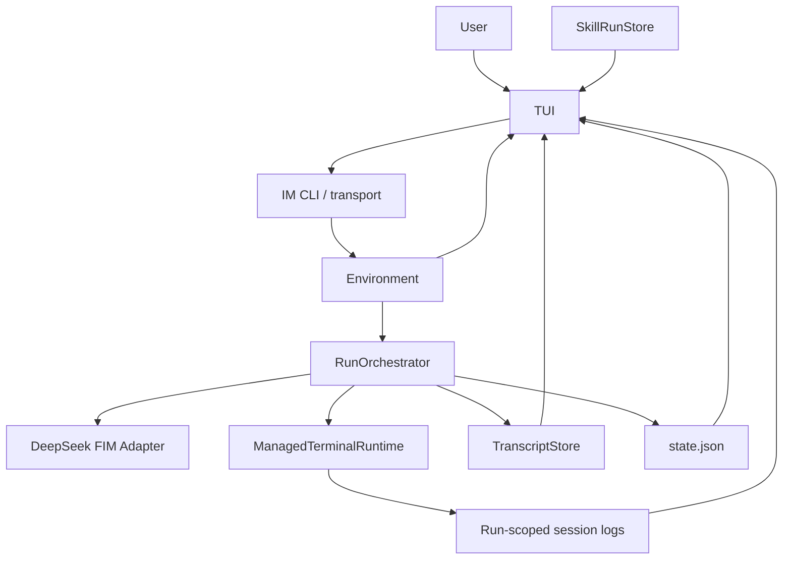

# TUI Design

本文记录 tiny-agent-harness 第一版 TUI 设计。

## Decision

TUI 是 observer / control surface，不是 harness 核心状态机。

它不拥有 Agent 状态，不参与模型决策，不直接改写 run state。它只读取已经存在的 durable artifacts，并把用户控制动作路由回现有边界。

```text
RunOrchestrator owns agent loop.
TranscriptStore owns run events.
ManagedTerminalRuntime owns PTY sessions.
Environment owns environment events and persistent reminder facts.
SkillRunStore owns skill run lifecycle.

TUI reads those facts and renders them.
```

推荐屏幕结构：

```text
┌────────────────────────────────────────────────────────────────────────────┐
│ Header: run id / status / step / cwd / model / active sessions / skills    │
├────────────────────────────────────────────────────────────────────────────┤
│ Conversation                                                               │
│ user messages, agent status replies, errors                                │
│                                                                            │
│                                                                            │
├────────────────────────────────────────────────────────────────────────────┤
│ Agent Loop Player                                                          │
│ step 000 model_requested                                                   │
│ step 000 thinking_received                                                 │
│ step 000 decision tool_call terminal_write(inputSeq=3)                      │
│ step 000 review approved                                                   │
│ step 000 terminal_write finished log=.tiny-agent/runs/<runId>/sessions/... │
│ step 001 environment reminder ...                                          │
└────────────────────────────────────────────────────────────────────────────┘
```

上半屏是用户可理解的对话流。下半屏是 agent loop 播放器，用来展示 ReAct 执行过程。

## Design Principles

1. TUI 是 transcript player，不是第二个 run orchestrator。
2. TUI 的可恢复状态只能是 UI 状态，例如当前 focus、scroll offset、follow mode。
3. 所有业务事实都来自 transcript、state snapshot、session log、environment、skill run state。
4. 用户输入不能直接塞进模型上下文，必须通过 IM transport 或已有控制端口。
5. PTY 输出默认只显示一屏 screen / excerpt，完整内容通过 log path 翻页。
6. TUI 退出不停止 run；run 停止也不要求 TUI 退出。
7. 第一版以清楚可调试为目标，不追求华丽动画。

## Non Goals

第一版不做：

- Web UI
- 多 run 并排监控
- 在 TUI 内编辑文件
- 在 TUI 内重新实现 PTY session manager
- TUI 私有保存 agent 状态
- 让 TUI 绕过 tool review 执行命令
- 高级可视化图表

## CLI Shape

推荐入口：

```bash
tiny-agent ui --channel default
tiny-agent ui --channel default --task "fix tests"
tiny-agent ui --channel default --resume latest
tiny-agent ui --channel default --resume run-2026-05-25T20-00-00Z
tiny-agent tui --run latest
tiny-agent tui --run run-2026-05-25T20-00-00Z
```

语义：

- `tiny-agent ui --channel default`: 后台启动 run，等待第一条 IM 消息，同时打开 live TUI。
- `tiny-agent ui --channel default --task "fix tests"`: 后台启动 run 并直接注入初始任务，同时打开 live TUI。
- `tiny-agent ui --channel default --resume <runId|latest>`: 恢复已有 run，并把 TUI attach 到恢复后的 run。
- `tiny-agent tui --run latest`: 只 attach 到最近 run，不启动或恢复 run。
- 当前 TUI 默认 live tail transcript；完整 replay speed control 仍是后续能力。

## Data Sources

TUI 只读这些 durable artifacts：

```text
.tiny-agent/
  runs/
    <runId>/
      state.json
      transcript.jsonl
      session.json
      im/
        default.inbox.jsonl
        default.outbox.jsonl
        cursors/
          default.cursor
      environment/
        events.jsonl
      sessions/
        default-37a8eec1ce.log
        server-4c1f3b8d2a.log
      skill-runs/
        <skillRunId>/
          state.json
          execution.txt
          review-task.txt
      debug/
        prompts/
          step-0000-thinking.prompt.txt
        thinking/
          step-0000-thinking.trace.txt
      mcp-servers.json
  skills/
    <skill>/
      attachments/
        lessons.md
```

Optional convenience pointer:

```text
.tiny-agent/runs/latest -> <runId>
```

如果不想做 symlink，也可以维护：

```text
.tiny-agent/runs/latest.json
```

内容：

```json
{
  "runId": "run-2026-05-25T20-00-00Z",
  "runDir": ".tiny-agent/runs/run-2026-05-25T20-00-00Z"
}
```

## Data Flow



TUI 读：

- transcript events
- latest run state
- run-scoped session log facts / fixed PTY viewport projections
- IM inbox/outbox
- active skill run state

TUI 写：

- user message through IM transport
- optional control request through existing control boundary
- UI local preferences only

## View Model

TUI 不直接渲染原始 JSONL。它把 artifacts 归一化成 view model。

```ts
type TuiViewModel = {
  run: RunHeaderView;
  conversation: ConversationItem[];
  loop: LoopFrame[];
  sessions: SessionView[];
  activeSkills: ActiveSkillView[];
  selected?: Selection;
};
```

### RunHeaderView

```ts
type RunHeaderView = {
  runId: string;
  status: AgentRunStatus;
  stepIndex: number;
  cwd: string;
  model?: string;
  startedAt?: string;
  updatedAt?: string;
};
```

### ConversationItem

```ts
type ConversationItem =
  | {
      kind: "user";
      timestamp: string;
      channel: string;
      text: string;
      sourceEventId?: string;
    }
  | {
      kind: "agent";
      timestamp: string;
      text: string;
      messageKind: "status" | "error";
    }
  | {
      kind: "system";
      timestamp: string;
      text: string;
    };
```

Conversation pane 只显示人和 agent 的通信，不塞完整 tool trace。

### LoopFrame

```ts
type LoopFrame = {
  id: string;
  stepIndex: number;
  timestamp: string;
  phase:
    | "model"
    | "decision"
    | "validation"
    | "review"
    | "tool"
    | "observation"
    | "environment"
    | "io_wait"
    | "skill";
  status: "pending" | "running" | "ok" | "warn" | "error" | "waiting";
  title: string;
  summary: string;
  detail?: string;
  logPath?: string;
  transcriptEventId?: string;
};
```

Loop player 显示 `LoopFrame[]`，而不是直接显示所有 JSON。

### SessionView

```ts
type SessionView = {
  session: string;
  state: "idle" | "running" | "blocked" | "terminated";
  currentCommand?: string;
  returnCode?: number | null;
  logPath: string;
  tail: string;
  tailOffset?: number;
};
```

### ActiveSkillView

```ts
type ActiveSkillView = {
  skillRunId: string;
  skill: string;
  status: "running" | "review_pending";
  executionReturnCode?: number;
  executionLogPath: string;
  reviewTaskPath?: string;
};
```

## Event Mapping

Transcript event 到 UI 的映射：

```text
run_started
  -> Header status running
  -> LoopFrame phase=environment title="run started"

model_requested
  -> LoopFrame phase=model status=running title="model requested"

model_thinking_delta
  -> Update current model LoopFrame status=running title="model thinking"
  -> Append delta into LoopFrame detail section "thinking"
  -> Render a trailing breathing cursor while the model frame is running
     (`• -> ● -> ⬤ -> ●`, keyed by the TUI render tick so it breathes even
     when no new delta arrives)
  -> Current runs write throttled transcript deltas for live TUI detail and
     also store the final streamed thinking trace as a debug artifact referenced
     by final model_output_received

model_output_received(tool_call)
  -> LoopFrame phase=decision status=ok title="tool call: terminal_write"
  -> Complete current model LoopFrame with final thinking/raw decision detail

model_decision_recorded(tool_call)
  -> Enrich existing decision LoopFrame detail section "decision trace"
  -> If no model_output_received frame exists, create a compact decision LoopFrame from structured facts

model_output_received(io_wait)
  -> LoopFrame phase=io_wait status=waiting title="io wait requested"
  -> Complete current model LoopFrame with final thinking/raw decision detail

model_decision_recorded(io_wait)
  -> Enrich existing io_wait LoopFrame detail section "decision trace"

model_output_received(invalid_output)
  -> LoopFrame phase=decision status=warn title="invalid model output"
  -> Complete current model LoopFrame with final diagnostic detail

model_decision_recorded(invalid_output)
  -> Enrich existing warning decision LoopFrame detail section "decision trace"

tool_call_validated(valid)
  -> LoopFrame phase=validation status=ok title="tool call validated"

tool_call_validated(invalid)
  -> LoopFrame phase=validation status=warn title="tool validation failed"

tool_review_requested
  -> LoopFrame phase=review status=running title="review requested"

tool_reviewed(approved)
  -> LoopFrame phase=review status=ok title="approved"

tool_reviewed(rejected)
  -> LoopFrame phase=review status=warn title="rejected"

tool_execution_started
  -> LoopFrame phase=tool status=running title="<tool> started"

tool_execution_finished
  -> LoopFrame phase=tool status=ok/error title="<tool> finished"

observation_appended
  -> LoopFrame phase=observation status=warn/ok title="synthetic observation"

io_wait_started
  -> LoopFrame phase=io_wait status=waiting title="waiting for IO"

io_wait_satisfied
  -> LoopFrame phase=io_wait status=ok title="IO wait satisfied"
     detail sections: wake reason (event id/kind/source/effective level/minLevel), wait, event

environment_events_consumed
  -> LoopFrame phase=environment status=ok title="environment reminder consumed"

agent_message_sent
  -> ConversationItem agent

user_message_received
  -> ConversationItem user

run_finished
  -> Header terminal status
  -> LoopFrame phase=environment status=ok/error title="run finished"
```

## Layout Details

### Header

Header 一行即可：

```text
run=run-123 status=waiting_for_io step=7 cwd=/repo model=deepseek-v4-pro sessions=2 skills=1
```

颜色建议：

- running / waiting: yellow
- failed / error: red
- cancelled: gray

### Conversation Pane

显示：

- user IM messages
- agent status messages, including user-facing completion replies sent through IM
- errors

不显示：

- 完整 bash 输出
- 完整 prompt
- 大段 raw JSON

输入栏放在 conversation pane 底部：

```text
message> _
```

发送后写入 IM transport，而不是直接调用模型。

输入栏使用真实终端光标定位到文本末尾，避免中文输入法候选窗远离输入点。普通 Enter 发送消息，Shift+Enter 在输入框内插入换行。

### Agent Loop Player

默认占下半屏。

显示策略：

1. 每个 step 聚合成一个 block。
2. 当前 step 自动展开。
3. 历史 step 默认折叠，只显示 phase summary。
4. 失败、等待、review rejected、invalid output 自动高亮。
5. Terminal output 显示 agent 可见的固定 PTY viewport 和 log path。
6. 选中某个 frame 后，右侧或弹窗显示 detail。

示例：

```text
step 004
  model       ok       thinking received (1820 chars)
  decision    ok       terminal_write(inputSeq=12, text="npm test\n")
  validation  ok       valid
  review      ok       approved by always-approve
  tool        running  session=default log=.tiny-agent/runs/<runId>/sessions/default-37a8eec1ce.log

step 005
  environment ok       2 events consumed
  skill       waiting  coding-review review_pending task=.tiny-agent/runs/<runId>/skill-runs/skillrun-001/review-task.txt
```

## Reasoning Display

DeepSeek FIM pass 1 会生成 thinking artifact。

TUI 可以显示它，但建议默认折叠：

```text
thinking... 1820 chars
Need inspect the current run state before choosing the next tool. ●
```

原因：

- 默认 UI 保持扫描友好。
- raw thinking 很长，会挤掉 tool trace；streaming 阶段的 detail 默认跟随尾部最新内容，并显示多尺寸圆点呼吸光标。
- 需要审计模型决策链路时，可以展开验证 two-pass ReAct 工作正常。

如果后续不想展示 raw thinking，可以改成只显示 thinking 摘要或保存路径。

## Log Viewing

TUI 不复制完整 log 到内存。PTY pane 首先使用 agent observation 对齐的固定 semantic terminal viewport；当 run 进入 `io_wait` 或长命令仍在输出而 transcript 尚未产生新的 terminal observation 时，TUI 每轮 poll 只读 run-scoped session log 的增量，并 replay 到 display-only terminal screen buffer。这个 live projection 不写入 runtime state、transcript 或 model context。

对 session log：

```text
render latest fixed-size screen projection when a terminal observation exists
replay session log bytes into a display-only screen buffer for live PTY display
read filtered log tail by byte offset only for explicit raw-log detail
keep selected logPath and offset in UI state
```

操作：

- 选中 `logPath` 后按 `o` 打开 log detail pane。
- detail pane 支持滚动。
- 按 `/` 在当前 log excerpt 内搜索。
- 完整搜索仍推荐通过 agent 自己用 bash 执行 `rg` / `sed` / `tail`。
- PTY 主 pane 是 read-only，不把 TUI 的实际窗口大小反向注入 runtime；runtime 的 `rows/cols` 决定 agent-visible observation viewport。live log projection 只是 TUI 观察层的补充，不能成为 agent-visible 事实来源。

### PTY Fit Priority

Agent-visible PTY size 是 runtime contract，例如 `80x24`。TUI 的职责是只读渲染这块固定 screen buffer，并尽量让人看到一模一样的内容：

1. 先按 `screen.rows` / `screen.cols` 计算 PTY pane 的最小可读区域。
2. 在当前终端窗口不足时，优先保证 PTY pane 完整，压缩 conversation / loop / detail 的高度或宽度。
3. 如果物理窗口仍不足，TUI 可以提示窗口太小，但不能偷偷改变 runtime PTY size。
4. Conversation、loop detail、debugger panes 都是辅助视图，不应该导致 PTY viewport 被截断后还显示为 `fit`。

这个规则保证 agent observation、TUI PTY pane、raw screen replay 三者同源：terminal observation 是固定 viewport 的事实来源，session log projection 是同一 PTY 输出的只读 live projection。差异只能来自字体/终端渲染能力或 bounded replay 窗口，而不是 harness 状态模型不一致。

## Follow And Selection

Conversation pane 和 Agent Loop pane 默认都保持置底。只有用户进入 browse mode 并用上下键移动当前 pane 时，该 pane 的 follow bottom 会暂停；另一个 pane 仍然可以继续置底。

回到 input mode 时：

- conversation follow bottom 恢复。
- loop follow bottom 恢复。
- loop selection 清除。

Conversation 是 transcript 与 IM poll 的合并 projection：

- 先按稳定 message key 去重。
- 再按 timestamp 升序渲染。
- timestamp 相同则保持进入 projection 的顺序。

Agent Loop 使用 frame-level selection。选中的是 `LoopFrame.id`，不是 blessed list 的文本行号。这样 step header、展开 detail 或 log path 增加额外行时，选中态仍然指向同一个 loop frame。

当 loop pane 处于 browse mode 且有选中 frame 时，下半屏切成左右两栏：

- 左侧：loop frame list。
- 右侧：selected frame detail，包括 step、phase、status、summary、detail、logPath。

## Debugger Domain

TUI 的调试能力分成两层：

- `ViewModelBuilder` 仍然是 transcript/run events -> `TuiViewModel` 的唯一主路径。
- `src/tui/debugger.ts` 消费 `TuiViewModel` / `LoopFrame` / run snapshot，提供纯函数式 debugger 数据。

当前 debugger domain 提供：

- `queryLoopFrames` / `matchesLoopFrame`：按文本、step、phase、status 和 warn/error 过滤 loop frames。
- `nextLoopFrameIndex`：在过滤结果中做稳定上下跳转。
- `buildLoopFrameDetail`：把现有 `## heading` detail 文本拆成结构化 sections，同时保留 raw detail。
- `summarizeLoopFrames`：统计 status、phase 和 problem frame 数。
- `buildRunIndex`：从显式 run snapshots 构造 run browser 行，不扫描文件系统。
- `buildRunBrowserControlIntent` / `buildRunBrowserControlIntentDisplay`：从显式 run rows 和 request 构造 attach/resume/control 的意图 metadata。结果只表达 `effect: "none"`、`owner: "runtime_cli"` 和 `review: "required"` 这些边界事实，不执行控制动作。
- `compareRuns`：比较两个 run 的状态、step、duration、frame/problem/conversation/session 计数。

这层不读文件、不读时间、不依赖 blessed renderer。后续 `/` 搜索、warn/error filter、历史 run browser、run compare 和 eval viewer 都应该基于这个 domain，而不是在 renderer 里重新实现一套逻辑。

## Keyboard

第一版快捷键：

```text
Esc          enter browse mode from input mode
Tab          switch focus between conversation and loop player in browse mode
j / Down     scroll down or move selected loop frame down
k / Up       scroll up or move selected loop frame up
g            jump to top
G            jump to bottom
f            toggle follow mode
Enter        expand/collapse selected frame
o            open selected log/detail path
/            search current pane
m            compose user message
Esc          cancel compose/search/detail
q            quit TUI only
?            show help
```

后续可加控制键：

```text
i            type text/key into the selected PTY when accepted
Ctrl-C       request interrupt selected session
R            request restart selected session
```

这些控制动作必须走已有 terminal/session tool boundary，并写入 transcript / environment，不能由 TUI 私下改 session 状态。

## Control Actions

TUI 的控制动作分两类。

### User Message

用户输入普通消息：

```text
m -> type message -> Enter
```

执行：

```text
TUI -> ImCliTransport.sendUserMessage / im CLI -> EnvironmentEvent(user_message_received)
```

Agent 下一轮通过 environment reminder 看到它。

### Runtime Control

例如给交互进程输入 `y\n`：

```text
i -> choose session -> type stdin -> Enter
```

必须路由到既有控制边界：

```text
TUI control request
  -> Runner control queue or ManagedTerminalRuntime control port
  -> transcript event
  -> environment event if session state/output changes
```

第一版可以不做 runtime control，只做 user message input。这样 TUI 更安全。

### Run Browser Control Intents

Run browser 可以显示 attach、resume、control 的 intent metadata，但这是展示和审计信息，不是 effectful control path。当前 TUI renderer 只渲染 view model 中的 `RunBrowserControlIntentDisplay[]`：

- valid intent 显示 action label、target run、`owner=runtime_cli`、`review: required` 和 `effect=none`。
- unavailable intent 显示紧凑的 `ctl: unavailable` / `why: ...`，用于解释缺少 target、未知 run 或 unsafe mutation 这类纯校验结果。
- attach/resume/control 的实际执行仍必须走 runtime/CLI 控制边界，并保留 tool review / transcript / environment event 链路。

因此 TUI 可以帮助 operator 看见“如果发起控制会指向谁、由谁拥有、是否需要 review”，但不能绕过 runtime 私下修改 run state，也不能把 display projection 当作 agent-visible fact 写回 transcript/model context。

## Live And Replay Modes

### Live

Live 模式 tail transcript：

```text
open transcript.jsonl
remember byte offset
read appended lines
parse RunEvent
update view model
render
```

如果 follow mode 开启，自动滚到底部。用户手动向上滚动时，follow mode 自动关闭。

### Replay

Replay 模式从头读取 transcript，并按速度播放：

```bash
tiny-agent tui --run run-123 --replay --speed 2
```

第一版可以只做 instant replay，即从头构建 view model，然后停在最后。

## Error Handling

TUI 遇到坏数据不应该崩。

规则：

1. JSONL 单行解析失败：显示 warning frame，继续读下一行。
2. `state.json` 不存在：从 transcript 重建 header 的 best effort 状态。
3. session log 不存在：显示 missing log，不阻塞 UI。
4. run 已结束但 TUI 仍打开：保持 replay view。
5. transcript 被截断或轮转：提示 reload。

## Rendering Backend

项目是 TypeScript CLI，当前运行时 renderer 使用 `neo-blessed`。

原因：

- 上下分屏和滚动 pane 是核心需求。
- 日志 tail、focus、快捷键用 terminal widget 更直接。
- 比自己手写 ANSI/raw mode 更少状态 bug。

当前渲染路径：

1. `TuiController` 读取 transcript / state / IM / session log projection。
2. `ViewModelBuilder` 构建 `TuiViewModel`。
3. `buildTuiPaneModel` 从显式输入计算 header、conversation、loop、detail、PTY pane 的 title、尺寸和可见内容。
4. `BlessedRenderer` 把这些 pane model 写入独立 `neo-blessed` widgets，并调用 `screen.render()`。

`renderTuiFrame` 只保留为纯文本 framebuffer projection，用于单元测试和调试输出。它和真实 blessed renderer 共享 `buildTuiPaneModel`，不能作为第二套运行时渲染逻辑演化。

保持抽象：

```ts
type TuiRenderer = {
  render(view: TuiViewModel): void;
  onKey(handler: (key: TuiKey) => void): void;
  close(): void;
};
```

这样后续可以从 `blessed` 换到别的库。

边界约束：

- 布局计算必须从 `TuiViewModel`、交互状态、窗口尺寸、scroll offset、animation frame 等显式参数推导。
- renderer 可以读取 blessed 的当前窗口尺寸；纯布局和内容函数不能读文件、时间、环境变量、session log 或 transcript。
- TUI pane 是 observer/control surface；它不改变 runtime PTY rows/cols，也不把 live display projection 写回 transcript 或 model context。
- Blessed pane widgets 不能共享同一行列坐标；相邻边框宁可独立显示，也不能通过 overlap 合成单线边框。
- 不保留整屏 styled frame repaint 作为运行时路径；需要文本投影时只使用纯 framebuffer helper。

## Performance

第一版约束：

- transcript 按 offset tail，不每轮全量读取。
- session log 只读 tail，并缓存未变化的 log stat，避免每轮重读完整文件。
- view model 对历史 step 做虚拟化或窗口化。
- 单个 LoopFrame detail 默认截断。
- 大 prompt / raw output 只显示路径。模型 prompt 通过 `promptRef` 指向 `debug/prompts/` artifact，不在 loop frame 内整段展开。

建议默认：

```ts
type TuiLimits = {
  maxConversationItems: 200;
  maxLoopFrames: 500;
  maxFrameDetailChars: 2000;
  maxLogTailLines: 200;
};
```

## First Version Scope

最小可用 TUI：

1. `tiny-agent tui --run latest`
2. 读取 `state.json` 和 `transcript.jsonl`
3. 上半屏 conversation pane
4. 下半屏 loop player
5. live tail transcript
6. independent follow bottom / scroll / loop frame selection / detail pane
7. terminal log path、固定 PTY viewport 和 output excerpt 显示
8. active skill reminder 显示
9. `q` 退出 TUI，不停止 run

可以暂缓：

- runtime control keys
- full replay speed control
- multi-run dashboard
- mouse support
- theme config
- split-pane resizing

## Team Dashboard View Model

The `src/tui/team-dashboard-view-model.ts` module provides a pure-function
`buildTeamDashboardViewModel()` that projects subagent team domain data into
structured rows/sections/selection suitable for TUI rendering.

### Boundary

This is strictly an **observer/control surface** — NOT a second orchestrator.
It does not:
- Start workers
- Bypass review
- Change runtime PTY rows/cols
- Read files, environment, network, or Date

### Inputs (explicit, typed)

- `TeamDashboardInput` with `SubAgentTeamSummary`, `ContactRegistrySummary`,
  `TeamDashboardRun[]`, optional `MasterReviewChecklist`, optional QA summary,
  optional `SupervisorLifecycleInput`

### Outputs

- `TeamDashboardViewModel` with sections, rows, selection tracking,
  status counts, and failure summary
- `redactDashboardDisplay()` for display-only redaction (must not
  pollute runtime prompt/model context)

### Supervisor Lifecycle Visibility

The optional `supervisor-lifecycle` section (`section kind: "supervisor-lifecycle"`)
projects supervisor operational state through the `SupervisorLifecycleInput`:

- **Leases** (`SupervisorLeaseItem[]`): leaseId, holder, resource, acquiredAt,
  expiresAt, renewedAt, status (active/expired/released), and
  `lastRenewedAgoMs` for freshness display (ok when <60s, warn when <300s,
  error otherwise).
- **Heartbeat cadence** (`heartbeatCadenceMs`): displayed in seconds.
- **Stale runs** (`StaleRunItem[]`): workerId, runId, lastHeartbeat, ageMs,
  reason, and `reaperPending` boolean (shows "Reaper pending" warn row when true).
- **Shutdown phase** (`ShutdownPhase`): active/draining/shutting_down/stopped,
  with optional `shutdownReason` string (displayed as warn row).
- **Dry run flag** (`dryRun`): displayed as info or warn.
- **Recovery readiness** (`recoveryReady`): boolean displayed as ok/warn.
- **Last audit event** (`AuditEvent`): timestamp, kind, summary; displayed as
  info row when present.

All fields are pure projections — callers pre-compute freshness, reaper flags,
reasons, and audit summaries. The view-model performs no fs/process/screen/Date
reads.

### Run-Scoped Lifecycle Audit Projection

`src/tui/lifecycle-audit-projection.ts` provides the adapter from durable
run-scoped lifecycle state to the dashboard's `auditEvents` projection:

- `projectLifecycleAuditEvents(events)` maps typed `SupervisorLifecycleEvent[]`
  into `LifecycleAuditEventItem[]`.
- `readRunLifecycleAuditProjection({ runDir, previousState })` tails
  `<runDir>/supervisor/lifecycle-events.jsonl` by byte offset and accumulates a
  bounded `state.auditEvents` list.
- `RunLifecycleAuditReader` keeps the offset state across TUI poll cycles.

The reader validates lifecycle events and reports malformed/invalid JSONL lines
without blocking valid events. It does not decide stale workers or execute
reaper/shutdown actions; callers pass `reader.read().state.auditEvents` into
`SupervisorLifecycleInput.auditEvents`.
